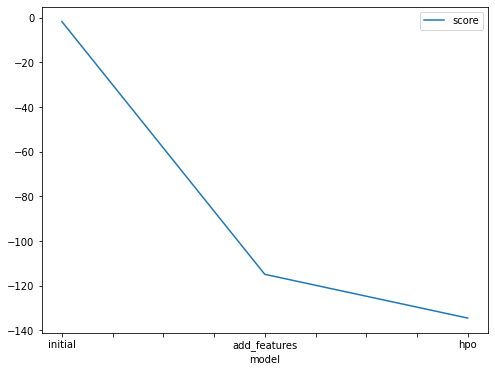
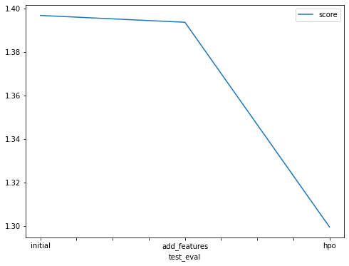

# Report: Predict Bike Sharing Demand with AutoGluon Solution
#### NAME HERE

## Initial Training
### What did you realize when you tried to submit your predictions? What changes were needed to the output of the predictor to submit your results?
I needed to call the predict method of predictor to generate the results
### What was the top ranked model that performed?
HPO model is the best model.

## Exploratory data analysis and feature creation
### What did the exploratory analysis find and how did you add additional features?
New features were added using datetime methods

### How much better did your model preform after adding additional features and why do you think that is?

Not very much but it was better than the model which was created before new features

## Hyper parameter tuning
### How much better did your model preform after trying different hyper parameters?

Yes - this time it was much better

### If you were given more time with this dataset, where do you think you would spend more time?

Probably would do some EDA and remove unnessary features and then will do hyperparameter tuning to optimize it further

### Create a table with the models you ran, the hyperparameters modified, and the kaggle score.
|model|hpo1|hpo2|hpo3|score|
|--|--|--|--|--|
|initial|?|?|?|1.39675|
|add_features|?|?|?|1.39361|
|hpo|?|?|?|1.29949|

### Create a line plot showing the top model score for the three (or more) training runs during the project.

### Create a line plot showing the top kaggle score for the three (or more) prediction submissions during the project.

## Summary
I think this was not an easy excercise. I needed to research quite a bit to complete this. Hypertuning was difficult to follow but I somehow did it. This is what I learned.
Even if the data is cleaned and provided by a reputable authority, there needed to be a bit of feature engineering required to get the best result. Although, AutoGluon helps to automate machine learning by finding the best model that can be used, still the results can be further optimized by using hyperparamters. Machine learning is an iterative process and there's always room for improvements. 